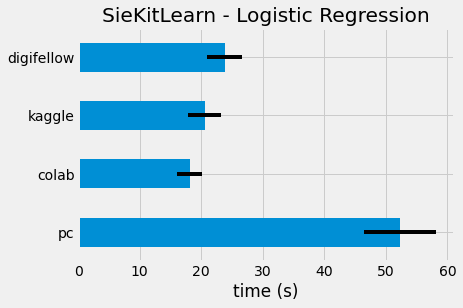
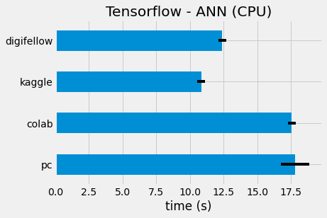
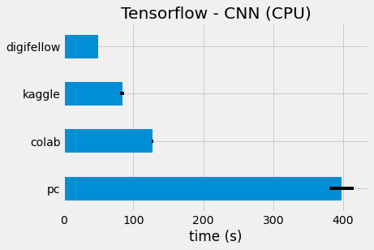
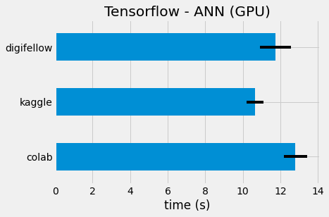
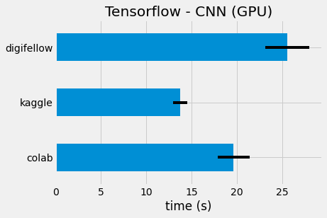
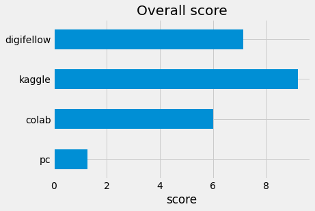

# Digifellow Benchmark Test
The computational performance of *[digifellow](https://digifellow.swfcloud.de/hub/spawn)* jupyterhub performance was tested against free access computing resources like *[Colab](https://colab.research.google.com/)* and *[Kaggle](https://www.kaggle.com/notebooks)*. The baseline of this comparison is an mediocre student PC *(Core i5 2.5GHz - 8GB RAM - No GPU)*

The computation objective is the classification of **MNIST** using different algorithms. The choice of this task is based on the relative simplicity of the task for the number of execution repeats. Additionally, image processing is the ideal setting to monitor the nuances of *GPU* performance.

> The performance of the trained models is irrelevant in this test and is therefore neglected. The results may vary significantly between algorithms, but that should not matter as far as the test is concerned.

## A. CPU Performance
The first part of the test considers the *CPU-Only* performance. The algorithms considered in this part are **Logistic Regression** and **Artificial Neural Networks**. The former is performed using `sklearn`  and is only considered for *CPU-Only* test. The later is executed through `tensorflow` and has two flavors; Namely, **Fully-Connected Neural Network** and **Convolutional Neural Network**
### 1. Logistic Regression
Beginning with an off-the-shelf classifier from `sklearn`, the aim was to observe the performance with a *CPU-Only* classifier that does not involve neural networks.
The results are promising as compared to the student *PC* which averaged over double the time of *digifellow*:
```
SieKitLearn - Logistic Regression
             pc      colab     kaggle  digifellow
mean  52.265645  18.102007  20.543421   23.803855
std    5.881398   2.039679   2.652598    2.892232
```

### 2. Fully-Connected Neural Network
Moving on `tensorflow`, which is the choice for most deep learning research. Fully-Connected **ANNs** can be very computationally expensive, and the test shows the limits of *CPU* capability.
The *digifellow* performance is quite excellent, surpassed only by *kaggle* by a relatively small margin:
```
Tensorflow - ANN (CPU)
             pc      colab     kaggle  digifellow
mean  17.830098  17.561319  10.839518   12.398528
std    1.042912   0.285654   0.280997    0.282626
```

### 3. Convolutional Neural Network
**CNNs** are a powerful tool for many high dimensional data. They can by excessively expensive on *CPUs*, which makes them very *GPU* hungry.
The results are incredible for *digifellow*, almost half the time for the second best choice:
```
Tensorflow - CNN (CPU)
              pc       colab     kaggle  digifellow
mean  397.404172  127.461974  84.140425   49.677589
std    17.501088    0.993961   2.873912    0.424330
```

## B. GPU Performance
The second part is the more significant in this test, since the *GPU* assets are the most expensive, and the least freely accessed by students. 

For *GPU*, only neural network algorithms are considered, since they perform significantly faster on *GPU* and `tensorflow` supports *GPU-Accelerated* operations.

> No *GPU* is available on the testing *PC*. Therefore, no *PC* data is included in this part of the test.
### 1.  Fully-Connected Neural Network
The lead of *digifellow* in *CPU* can still be seen with the **ANN**. It comes second to *kaggle* with a slight improvement from the *CPU-Only*:
```
Tensorflow - ANN (GPU)
      pc      colab     kaggle  digifellow
mean NaN  12.797829  10.648346   11.751862
std  NaN   0.628303   0.441335    0.825919
```

### 3. Convolutional Neural Network
With the **CNN**, both *kaggle* and *colab* seem to best *digifellow* by a considerable difference. However, the *GPU* performance is almost twice as fast as *CPU* for **CNNs**:
```
Tensorflow - CNN (GPU)
      pc      colab     kaggle  digifellow
mean NaN  19.645530  13.769940   25.541576
std  NaN   1.771591   0.796525    2.443222
```

## Conclusion
In the end, it is evident that the compute needed for ML and DL tasks is excessive for the average student computer and outsourcing becomes all the more vital. With the free-access outlets enforcing upper-limit to the amount of compute available, *digifellow* offers students a continuous access to incredible resources. Averaging the performance of all the previous tasks, a score was developed to give an overall rating for each of the resources at hand, the scores are shown below:


