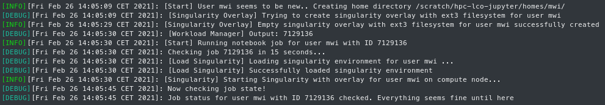

# JupyterHub + High-Performance Computing

*- High performance Jupyter Notebooks -*

The aim of this project is to connect JupyterHub to a high-performance computer (HPC). By automatically outsourcing the computations to the HPC system, even complex calculations are possible. While JupyterHub is deployed on a regular server, the notebooks themselves are spawned and run on the remote HPC system.

**Motivation**

The technical core of this project is the transparent integration of digital worksheets (Jupyter notebooks), in which learning content and programs can be displayed, edited and executed on the students' own laptops, with current cloud and high-performance computing (HPC) technologies. This provides the conditions for innovative, digital teaching that encourages independent and interactive development of, for example, data science applications, without imposing the complexity of using a high-performance computer system on the students. Instead, particularly computationally and data-intensive calculations are automatically offloaded to a high-performance computer, enabling even sophisticated analyses to be performed that would otherwise not be feasible on students' laptops.

---

## Table of Contents

- [Installation JupyterHub Server](#installation-jupyterhub-server)
  - [JupyterHub and BatchSpawner](#jupyterhub-and-batchspawner)
  - [SSH tunnel user](#ssh-tunnel-user)
  - [Node mapping](#node-mapping)
- [Installation HPC System](#installation-hpc-system)
  - [Requirements](#requirements-1)
  - [Clone Repository](#clone-repository)
  - [Singularity Container](#singularity-container)
    - [Build Singularity Container](#build-singularity-container)
      - [Compute](#compute)
      - [GPU (Tensorflow)](#gpu-tensorflow)
  - [Configuration Wizard for Slurm](#configuration-wizard-for-slurm)
    - [Start the configuration wizard](#start-the-configuration-wizard)
- [Examples](#examples)
- [Logging](#logging)
  - [Debug mode](#debug-mode)
- [Shibboleth Integration](#shibboleth-integration)
- [nbgrader Integration](#nbgrader-integration)
  - [Installation](#installation)
  - [Changing the Student ID to the JupyterHub logged in user name](#changing-the-student-id-to-the-jupyterhub-logged-in-user-name)
  - [Create nbgrader_config.py](#create-nbgrader_configpy)
- [Using WebDAV](#using-webdav)
- [Security Precautions](#security-precautions)
  - [Singularity Host Filesystems](#singularity-host-filesystems)
  - [JupyterHub API (https or SSH tunnel)](#jupyterhub-api-https-or-ssh-tunnel)
    - [https](#https)
    - [SSH Tunnel](#ssh-tunnel)
  - [tunnelbot User](#tunnelbot-user)
- [Troubleshooting](#troubleshooting)

---

## TODO

* User Accounting Information on HPC-Side
* JupyterHub: Shibboleth Integration

## Installation JupyterHub Server

This section describes the required installations and configurations on the JupyterHub server.

### JupyterHub and BatchSpawner

The first thing you should do is install JupyterHub and BatchSpawner. For this purpose we provide an Ansible playbook which can be found in `/jupyterhub-deployment/`. The the README for details. Alternatively, you can follow the official installation instructions.

If you decide to do the installations yourself, please proceed as follows:

- install [JupyterHub](https://jupyterhub.readthedocs.io/en/stable/installation-guide-hard.html)
- install [BatchSpawner](https://github.com/jupyterhub/batchspawner)
- copy the JupyterHub configuration (`/jupyterhub-deployment/config_files/jupyterhub_config.py`) to `/opt/jupyterhub/etc/jupyterhub/`
- restart the JupyterHub service

### SSH tunnel user

A user called `tunnelbot` is needed on the JupyterHub server. This user is responsible for starting an SSH tunnel between the compute node and the JupyterHub server. An SSH key pair for the above mentioned purpose must be generated. See `/examples/jupyterhub_config.py` for more information.

### Node mapping

JupyterHub extracts the execution host name of the HPC system (e.g. `node01-002`). When a notebook server is started, an SSH tunnel is established using the notebook port.

In order for JupyterHub to be able to resolve the compute nodes host name, the `/etc/hosts` file must be edited. An example entry might look like the following:

```
127.0.0.1 node01-001
127.0.0.1 node01-002
127.0.0.1 node01-003
...
127.0.0.1 node12-048
```

The actual node names depend on your HPC system of course.

---

## Installation HPC System

### Requirements

* You need a user who is allowed to allocate resources on the HPC system
  * The public key part of the tunnelbot-user created on the JupyterHub (-> _~/.ssh/authorized_keys_)

#### Requirements (If you want to use Singularity)

* __Singularity (> v.3.7.0)__ (If you want to use Singularity)
* e2fsprogs with following option:
  * https://git.kernel.org/pub/scm/fs/ext2/e2fsprogs.git/commit/?id=217c0bdf17899c0f79b73f76feeadd6d55863180
* A directory to create a valid overlay for Singularity (See the official docs: https://sylabs.io/docs/)

### Clone Repository

The best way is to copy the repository into a scratch directory of the user who is allowed to allocate resources.

```bash
git clone https://github.com/pc2/JHub-HPC-Interface.git
```

### Singularity Container

Singularity recipe examples are in the directory SINGULARITY/.

> INFO: If you do not want to use Singularity, just set `$use_singularity` in _jh_config_ to `false`.

#### Build Singularity Container

The following commands replace USER_ID in the recipes to the output of `id -u`, creates a new hidden file, and builds the singularity container with the new created file.
 
##### Compute

```bash
USER_ID=$(id -u) && sed "s/USER_ID/$USER_ID/" < SINGULARITY/Singularity > SINGULARITY/.recipefile_compute && singularity build --remote SINGULARITY/compute_jupyter.sif SINGULARITY/.recipefile_compute
```

##### GPU (Tensorflow)

```bash
USER_ID=$(id -u) && sed "s/USER_ID/$USER_ID/" < SINGULARITY/Singularity_Tensorflow > SINGULARITY/.recipefile_gpu && singularity build --remote SINGULARITY/gpu_jupyter.sif SINGULARITY/.recipefile_gpu
```

_singularity build help section_:
> __-r, --remote__            build image remotely (does not require root)

Please refer to the offical docs how to use the remote build featue: https://sylabs.io/docs/

### Configuration Wizard for Slurm

The configuration wizard is an interactive script to configure the HPC environment with JupyterHub.
The script creates a temporary configuration file at the end, which can be copied with a simple `cp`.

#### Start the configuration wizard

Just type following in your terminal:
```bash
./jh_slurm_wizard
```

If you are using another workload manager, you can configure _jh_config_ manually.

---

## Examples

You will find examples for the configuration files jh_config and jupyterhub_config.py in the directory _examples/_.

---

## Logging



The function that stores log information is defined in the configuration file `jh_config`.
In each wrapper script, the `create_log_entry` function stores log files in the `$log_dir`.

The `jh_show_log` script can be used to retrieve current logs.

### Debug mode

By default the logs contain only information such as warnings or error messages.
It is also possible to switch on the debug mode, which writes extended information into the log files.

Just set `$enable_debug_mode` in the configuration file to true.

---

## Shibboleth Integration

**Work-In-Progress**

---

## nbgrader Integration

### Installation

Installation insturctions:
https://nbgrader.readthedocs.io/en/latest/configuration/jupyterhub_config.html

To create an exchange directory for every user, just create an empty directory in `$scratch_dir` and mount it into the container with `$singularity_bind_extra`.

### Changing the Student ID to the JupyterHub logged in user name

Since the containers run as user jovyan, the value from the `$JUPYTERHUB_USER` variable is automatically used.

See here for more information: 
https://jupyter.readthedocs.io/en/latest/community/content-community.html#what-is-a-jovyan

### Create nbgrader_config.py

See here: https://nbgrader.readthedocs.io/en/stable/configuration/nbgrader_config.html#use-case-3-nbgrader-and-jupyterhub

To make _nbgrader_config.py_ available in the container, just append the file in `$singularity_bind_extra`.

---

## Using WebDAV

> Example: https://github.com/jmesmon/wdfs

---

## Security Precautions

### Singularity Host Filesystems

In case you are using Singularity, the host filesystems may be automatically mounted into the container when you start a Singularity Container.

A possible cause is the option `mount hostfs` in _singularity.conf_

See here: https://sylabs.io/guides/3.5/admin-guide/configfiles.html#singularity-conf

### JupyterHub API (https or SSH tunnel)

#### https

See here for more information:
https://jupyterhub.readthedocs.io/en/stable/reference/websecurity.html

#### SSH Tunnel

To make the JupyterHub API available on the compute node, a reverse SSH tunnel can be started from the compute node. For this purpose a "tunnelbot" user with an SSH key is created.

Set `$ssh_tunnel_api` to true.

The variables `$ssh_jh_ip`, `$ssh_tunnel_user` and `$ssh_priv_key` are set in the configuration file _jh_config_.

After _jh_starttunnel_ and _jh_batchspawner_singleuser_replace_ have been mounted into the container, the tunnel is built and the API then listens on _**127.0.0.1:8083**_

**Why 8083 and not default 8081?**

Most HPC systems use Bright as their cluster management system.
Bright uses port 8081.

The port number can be changed with option `ssh_tunnel_api_port` in _jh_config_

### tunnelbot User

You can increase the security by deactivating shell access for this user.

Just type:

```bash
usermod -s /bin/false tunnelbot
```

---

## Troubleshooting
